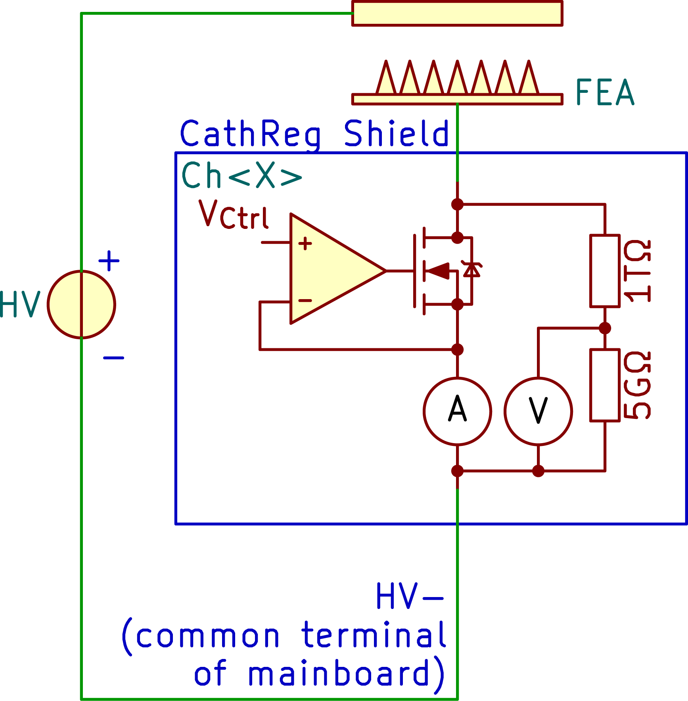

# FEAR-Cathode Regulation
This repository contains the KiCAD-design files for a shield of the F(ield) E(mission) A(rray) R(egulation) current control circuit.

Note: This project is part of the SubModule-repository [FE-FEAR16v2][FE-FEAR16v2-SubmoduleRepo], where you can find sub-repositories for other shield-PCBs, mainboard-PCB and the firmware.

# Description
The name "cathode regulation" comes from the original main purpose of regulating the potential (extraction voltage) of a field emission array (FEA = cathode) based on the current through this cathode. However, it can be used for all purposes where a potential needs to be regulation based on the current-flow through the device under test. During active regulation this shield acts like a current-source/-sink.

- The shield itself takes 1 DAC-output voltage (V~Ctrl~ = 0..10V) to adjust the current control.
- The A(mperemeter) is actually a shunt-resistor which defines the measurable current range. A 1MΩ for instance yields a range from 0.31 nA (resolution) to 10 µA, whereby its wisely to keep the current slightly below as 10 µA is the absolute maximum measurable value.
- The V(oltmeter) measures the internal voltage-drop over the FET.

Note: Both, A and V use potentiometers to adjust their feedback-loop amplification. Due to tolerances on all the parts, its recommended to use a shield only at a specific mainboard and a specific channel-position at which the boards were calibrated.

**Principle of the cathode regulation:**

# HowTo to connect (samples and for calibration)
1. Place a shield on a mainboard/channel-slot.
2. Calibration: continue with step 3.), otherwise go to 6.)

3. Connect the positive supply of the high-voltage source to the FEA-input (see figure above) and the negative supply (GND) to the HV- input. For a fine calibration, add an amperemeter in series.

    1. Apply a high voltage to the input (e.g. 1kV) and define a V~Ctrl~ (e.g. 9V).

4. Calibrate V~Shnt~
    1. Adjust the current gain potentiometer, so that the measured ADC value divided by the shunt-resistance is equal to the amperemeter-value (V~Shnt~/R~Shunt~ = I~Amperemeter~)

5. Calibrate V~Drp~
    1. Adjust the voltage-drop gain potentiometer. The board projects a voltage range of &pm;1500V into a range of &pm;10V using a voltage divider with huge resistance values. Example for positive voltage:
    1500V * 5GΩ / 1005GΩ * Gain = 7.462..V * Gain = 10V
    Gain = 10V / 7.462..V = 1.34

6. Connect FEA on the shield's screw terminal and the most negative supply to to HV- (which is the mainboard's common-terminal).

Note: The FEAR command-documentation can be found in the firmware-repository (see [FE-FEAR16v2 Submodule-Repo][FE-FEAR16v2-SubmoduleRepo]).

[FE-FEAR16v2-SubmoduleRepo]: https://github.com/Dephrilibrium/FE-FEAR16v2